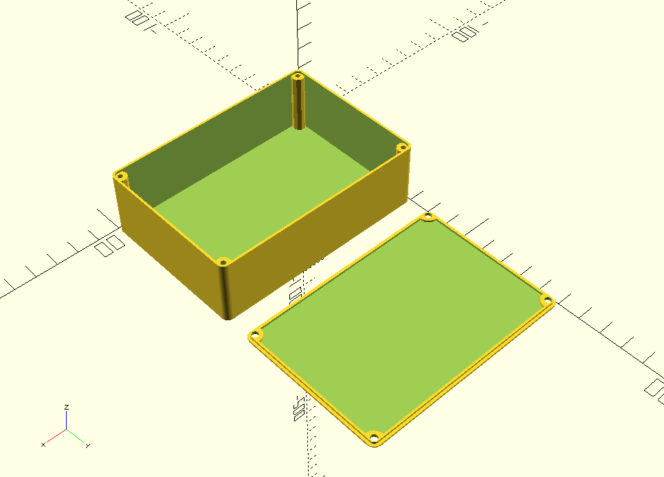

# Jennys-rectangular-project-box
An OpenSCAD module for creating custom 3D-printable parametric project boxes.

## Usage

All dimensions are in mm.

### projectBox()

Creates the box itself

**projectBox(x,y,z,cornerRadius=3,wallThickness=1,threadRadius=1.25)**

x,y,and z are the box dimensions.
cornerRadius is the outer radius of the box corner.
wallThickness is the thickness of the box wall.
threadRadius is the size of the hole for a self-tapper screw to enage with.

### projectBoxLid()

**projectBoxLid(x,y,z,cornerRadius=3,wallThickness=1,threadRadius=1.25,toleranceGap=0.1)**

x,y,and z are the box dimensions.
cornerRadius is the outer radius of the box corner.
wallThickness is the thickness of the box wall.
threadRadius is the size of the hole for a self-tapper screw to enage with.
toleranceGap is the size of any gap between lid and box, tolerance to ensure they fit.

## Example.

The following code creates a project box and lid 100x70x30mm, with a 3mm corner radius, a 1mm wall thickness, and a 1.25mm screw thread radius

 **projectBox(100,70,30,3,1,1.25);**
 
 **translate([0,80,0]) projectBoxLid(100,70,30,3,1,1.25);**
 
 It produces the render in the image below.
 

## Licence

THis library is licensed under the [Creative Commons Attribution Share Alike 4.0 International licence](license.md).
